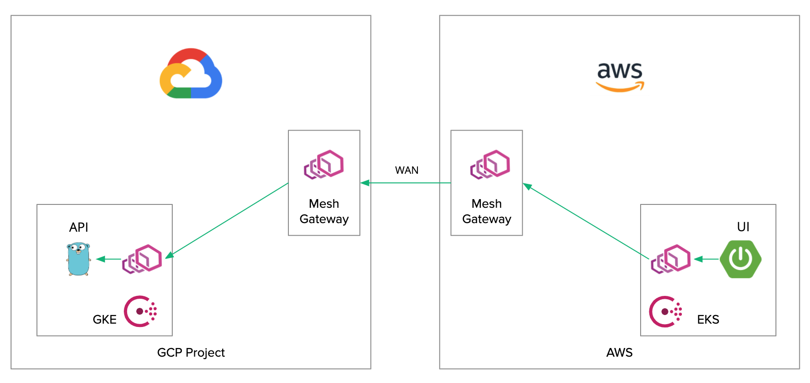
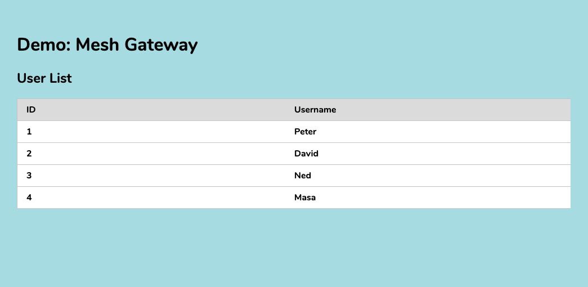

#setup (1.9.1)

Helm
```shell script
helm repo add hashicorp https://helm.releases.hashicorp.com
helm search repo hashicorp/consul
```

Consul GKE
```shell script
helm install -f helm-consul-dc1-gke-values.yaml consul hashicorp/consul
kc get secret consul-federation -o yaml > consul-federation-secret.yaml
```

Consul EKS
```shell script
helm install -f helm-consul-dc2-eks-values.yaml consul hashicorp/consul
kc apply -f consul-federation-secret.yaml
```

API Go (on GKE)
```shell script
kc apply -f rds-secret-gke.yml
kc apply -f api-go-gke.yaml
```

UI Java (on EKS)
```shell script
kc apply -f ui-java-eks.yaml
```

Note: 
```shell script
eksctl create cluster \
    --name=consul-mesh-gateway-cluster-2 \
    --nodes=3 \
    --node-ami=auto \
    --region=ap-northeast-1 \
    --version 1.17
```